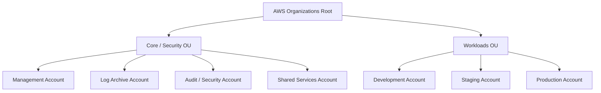
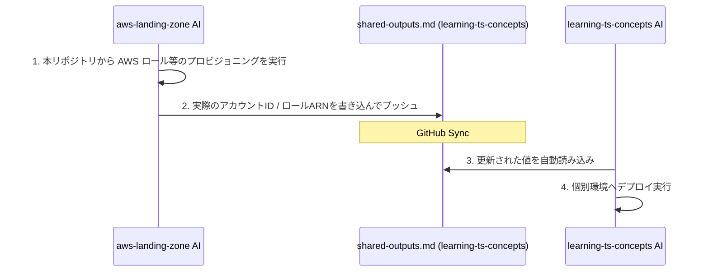

# aws-landing-zone (AWS Multi-Account Governance Repository - Terraform Version)

このリポジトリは、AWS Organizations および AWS Control Tower を用いて、エンタープライズ規模のマルチアカウント構造、ガードレール（SCP）、およびガバナンスを **Terraform (HCL)** で一元管理するためのインフラベースラインリポジトリです。

個別ワークロードリポジトリである **[learning-ts-concepts](https://github.com/shadow-architect-dev/learning-ts-concepts)** と連携し、安全な3層Webアーキテクチャを実行するための「土台（プラットフォーム）」を構成します。

---

## 🏗️ 組織・アカウント設計（Landing Zone）

本リポジトリでは、以下の Organizations OU（組織単位）およびアカウント構造のプロビジョニングと統制を管理します。



### 📂 管理リソース・ディレクトリ構成

*   `policies/` - 組織共通ガードレール（SCP）およびタグポリシー定義（JSON）
    *   `scp/`: 許可リージョン制限（東京のみ）、監査機能無効化防止、本番データ削除防止（S3バージョニング保護含む）の SCP 定義。
    *   `tag-policies/`: `Environment`, `Project` タグの付与と値を強制するタグポリシー定義。
*   `identity/` - Google Workspace (SAML & SCIM) 連携による AWS IAM Identity Center (SSO) 設計および運用ガイド
    *   [README.md](file:///c:/Git/aws-landing-zone/identity/README.md): Google Workspace を唯一の IdP とする IAM Identity Center 権限割り当て設計
    *   [google-workspace-setup.md](file:///c:/Git/aws-landing-zone/identity/google-workspace-setup.md): Google Workspace SAML & SCIM 連携セットアップ手順書
    *   [break-glass-runbook.md](file:///c:/Git/aws-landing-zone/identity/break-glass-runbook.md): 緊急アクセス（Break-Glass）運用・監査ランブック
*   `terraform/` - Terraform によるインフラ定義およびアカウント管理基盤
    *   [accounts.yaml](file:///c:/Git/aws-landing-zone/terraform/accounts.yaml): 組織内の全アカウント構造を GitOps 管理するための定義ファイル。
    *   [providers.tf](file:///c:/Git/aws-landing-zone/terraform/providers.tf): 複数アカウント間でのロール引き受け（Assume Role）によるプロバイダー定義。
    *   [backend.tf](file:///c:/Git/aws-landing-zone/terraform/backend.tf): S3 バケットおよび DynamoDB を使用した状態ロック設定。
    *   [main.tf](file:///c:/Git/aws-landing-zone/terraform/main.tf): 各モジュールの呼び出しとパラメータ結合。
    *   [imports.tf](file:///c:/Git/aws-landing-zone/terraform/imports.tf): 既存の CDK でプロビジョニングされたリソースを再作成せずにインポートするための `import` ブロック群。
    *   `modules/`: 各スタックを移行したモジュール群（`organizations`, `log_archive`, `security_audit`, `identity`, `shared_services`, `account_factory`）。
*   `docs/` - 運用管理ドキュメント
    *   [gitops-terraform-runbook.md](file:///c:/Git/aws-landing-zone/docs/gitops-terraform-runbook.md): CDK から Terraform への安全な移行手順、および新規アカウント追加・削除の GitOps 運用マニュアル。

---

## 🔗 リポジトリ間連携（ドキュメント駆動）について

本リポジトリは、セキュリティ上、個別ワークロードリポジトリ（`learning-ts-concepts`）と完全に権限境界を分離しています。

インフラ接続情報の同期には、**[shared-outputs.md](https://github.com/shadow-architect-dev/learning-ts-concepts/blob/main/docs/governance/shared-outputs.md)** を介したドキュメント駆動の連携を行います。



---

## 🔑 ユーザー側で必要なアクション (Setup & Configuration)

本マルチアカウント環境のテンプレートを実際に AWS 上に展開し運用するには、以下の設定と手動アクションが必要です。詳細は [gitops-terraform-runbook.md](file:///c:/Git/aws-landing-zone/docs/gitops-terraform-runbook.md) をご確認ください。

### 1. アカウント定義の宣言と払い出し (GitOps / Control Tower 連携)
1. **アカウント情報の記述**:
   - [terraform/accounts.yaml](file:///c:/Git/aws-landing-zone/terraform/accounts.yaml) に、作成したい AWS アカウント名や管理者メールアドレス、所属 OU を定義します。
2. **アカウント払い出しのデプロイ**:
   - 管理（Management）アカウントに対し、アカウント作成モジュールをデプロイします：
     ```bash
     terraform init
     terraform apply -target=module.account_factory
     ```
   - これにより AWS Control Tower の Account Factory が呼び出され、安全に各アカウントが自動プロビジョニングされます（完了まで15〜30分程度）。

### 2. Google Workspace 連携とパラメータ取得 (SSO/SCIM 設定)
1. **SAML / SCIM 連携設定**:
   - [google-workspace-setup.md](file:///c:/Git/aws-landing-zone/identity/google-workspace-setup.md) の手順に従って、Google Workspace 側で SAML アプリの作成、ユーザーアクセス権の絞り込み、SCIM 同期を設定します。
2. **パラメータの収集と設定**:
   - [terraform/variables.tf](file:///c:/Git/aws-landing-zone/terraform/variables.tf) を開き、作成された AWS アカウント ID、SSO インスタンス ARN、SCIM 同期グループの Principal ID を更新します。

### 3. AWS 認証情報のセットアップ
管理（Management）アカウントに対する操作権限を持つ AWS CLI プロファイルを用意します。
```powershell
aws configure
# もしくは環境変数の設定
$env:AWS_PROFILE="my-management-profile"
```

### 4. ベースラインの適用（デプロイ）
アカウントの払い出しおよびパラメータの設定が完了したら、全リソースを適用します。
```bash
terraform apply
```

### 5. 個別ワークロード側へのパラメータ同期 (shared-outputs.md)
デプロイ完了後、作成された OIDC 信頼ロールの ARN や アカウントID 等の出力値を、個別ワークロードリポジトリ (`learning-ts-concepts`) の [docs/governance/shared-outputs.md](file:///c:/Git/learning-ts-concepts/docs/governance/shared-outputs.md) に書き込み、コミットしてプッシュしてください。これにより、ワークロード側の CI/CD が自動デプロイ可能になります。
