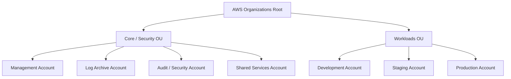
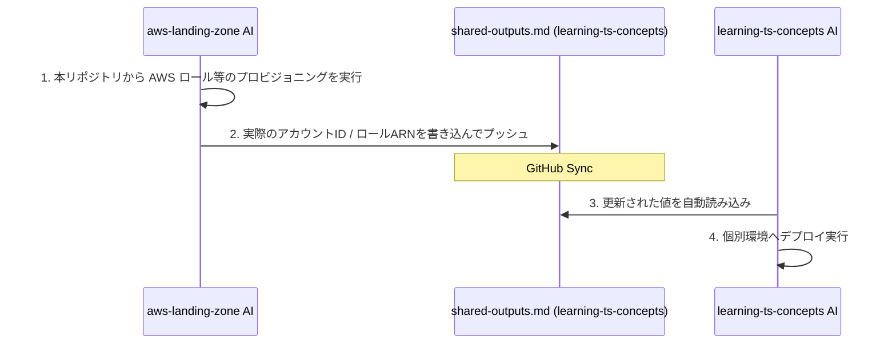

# aws-landing-zone (AWS Multi-Account Governance Repository)

このリポジトリは、AWS Organizations および AWS Control Tower を用いて、エンタープライズ規模のマルチアカウント構造、ガードレール（SCP）、およびガバナンスをコードで管理するためのインフラベースラインテンプレートです。

個別ワークロードリポジトリである **[learning-ts-concepts](https://github.com/shadow-architect-dev/learning-ts-concepts)** と連携し、安全な3層Webアーキテクチャを実行するための「土台（プラットフォーム）」を構成します。

---

## 🏗️ 組織・アカウント設計（Landing Zone）

本リポジトリでは、以下の Organizations OU（組織単位）およびアカウント構造のプロビジョニングと統制を管理します。



### 📂 管理リソースと構成予定ディレクトリ

- `organizations/` - Organizations 組織構造・OU定義
- `policies/` - 共通ガードレール（SCP: サービスコントロールポリシー）定義
  - 許可リージョン制限（ap-northeast-1 以外でのリソース作成拒否）
  - セキュリティ監査機能（GuardDuty/Security Hub/Config/CloudTrail）の無効化・削除防止
  - 本番データの意図しない削除制限
- `identity/` - AWS IAM Identity Center (SSO) の権限セット・グループ管理
- `shared-services/` - 各環境共通で利用する CI/CD デプロイ用 IAM ロールの設定

---

## 🔗 リポジトリ間連携（ドキュメント駆動）について

本リポジトリは、セキュリティ上、個別ワークロードリポジトリ（`learning-ts-concepts`）と完全に権限境界を分離しています。

インフラ接続情報の同期には、**[shared-outputs.md](https://github.com/shadow-architect-dev/learning-ts-concepts/blob/main/docs/governance/shared-outputs.md)** を介したドキュメント駆動の連携を行います。



---

## 🔑 ユーザー側で必要なアクション (Setup & Configuration)

本マルチアカウント環境のテンプレートを実際に AWS 上に展開し運用するには、以下の設定と手動アクションが必要です。

### 1. 各 AWS アカウントのプロビジョニング (事前準備)
CDK による統制ポリシーアタッチの対象となる各種 AWS アカウントを作成します。
*   **AWS Control Tower を利用する場合 (推奨)**:
    管理（Management）アカウントで Control Tower を有効化すると、初期セットアップで `Log Archive` アカウントおよび `Audit` アカウントが自動的に払い出されます。その後、Control Tower 内の「Account Factory」を使用して、開発（Dev）、検証（Stg）、本番（Prod）アカウントを個別に作成します。
*   **AWS Organizations を直接利用する場合**:
    管理アカウントのコンソールから「組織の作成」を行い、各アカウント（Log Archive, Audit, Shared Services, Dev, Stg, Prod）を手動で新規作成してください。

### 2. 接続先 AWS 情報の設定
[config/landing-zone-config.json](file:///c:/Git/aws-landing-zone/config/landing-zone-config.json) を開き、実際の AWS 組織（Organizations）の情報を設定してください。
*   `rootId`: AWS Organizations Root の識別ID（例: `r-abcd`）
*   `accounts`: 前ステップで払い出した各 AWS アカウントの 12桁のアカウントID。

### 3. AWS 認証情報のセットアップ
管理（Management）アカウントに対する操作権限を持つ AWS CLI プロファイルを用意します。
```powershell
aws configure
# もしくは環境変数の設定
$env:AWS_PROFILE="my-management-profile"
```

### 4. CDK のブートストラップ (Bootstrap)
管理アカウント、および各メンバーアカウントへ CDK のリソースデプロイ用バケット等を作成します。
```powershell
# 管理アカウントのブートストラップ (ap-northeast-1)
npx cdk bootstrap aws://<Management_Account_ID>/ap-northeast-1
```

### 5. スタックのデプロイ
ベースラインを AWS 組織上に展開します。
```powershell
# 全スタックのデプロイ
npx cdk deploy --all
```

### 6. 個別ワークロード側へのパラメータ同期 (shared-outputs.md)
デプロイ完了後、作成された OIDC 信頼ロールの ARN や アカウントID 等の出力値を、個別ワークロードリポジトリ (`learning-ts-concepts`) の [docs/governance/shared-outputs.md](file:///c:/Git/learning-ts-concepts/docs/governance/shared-outputs.md) に書き込み、コミットしてプッシュしてください。これにより、ワークロード側の CI/CD が自動デプロイ可能になります。

---

## 🚀 開発・運用の進め方

本リポジトリに変更を加える際は、以下のステップを実行します。

1. **ベースラインの合成・検証**:
   - `npm run build` を実行して TypeScript のコンパイルエラーが無いことを確認します。
   - `npx cdk synth` を実行して、出力される CloudFormation 定義（SCP、タグポリシーなど）を検証します。
2. **アカウント作成・変更**:
   - アカウントの払い出しやデプロイ用ロールの追加が完了したら、連携用の `shared-outputs.md` に対して最新の接続パラメータを書き出してマージします。
