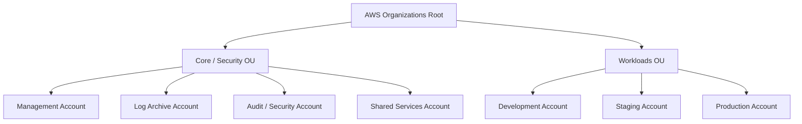
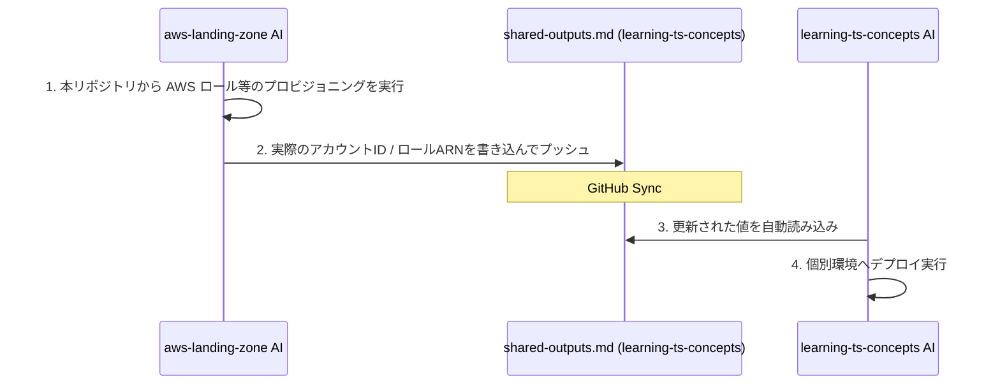

# aws-landing-zone (AWS Multi-Account Governance Repository - Terraform Version)

このリポジトリは、AWS Organizations および AWS Control Tower を用いて、エンタープライズ規模のマルチアカウント構造、ガードレール（SCP）、およびガバナンスを **Terraform (HCL)** で一元管理するためのインフラベースラインリポジトリです。

個別ワークロードリポジトリである **[learning-terraform-concepts (EKS 3層インフラ)](https://github.com/shadow-architect-dev/learning-terraform-concepts)** および **[learning-ts-concepts (ECS Fargate 3層インフラ)](https://github.com/shadow-architect-dev/learning-ts-concepts)** と密に連携し、安全なマルチアカウントWebアプリケーションアーキテクチャを実行するための共有サービス・閉域ネットワーク等の「土台（プラットフォーム）」を構成します。

---

## 🏗️ 組織・アカウント設計（Landing Zone）

本リポジトリでは、以下の Organizations OU（組織単位）およびアカウント構造のプロビジョニングと統制を管理します。



## 🚀 プラットフォーム高度化機能（Platform Capabilities）

マルチアカウントの基盤統制に加え、本 Landing Zone では以下の高度なプラットフォーム機能をプロビジョニングし、運用の自動化、FinOps の最大化、統合監視を実現しています。

1. **AWS Control Tower AFT (Account Factory for Terraform) 連携＆GitOps自動化**:
   - `aft.tf` を用いて、AWS公式の AFT 管理エンジン（v1.15.0）を Management アカウントへデプロイ。
   - `accounts.yaml` への追加をトリガーとし、VCS（GitHub）連携経由で、アカウントの払い出しから入れ子 OU（Nested OU）への自動配置、SecurityHub 有効化などの共通ベースライン（Global Customizations）適用までを完全自動化（No-Touch Provisioning）する GitOps パイプラインを構築。
2. **Transit Gateway ＆ AWS RAM による Hub-and-Spoke 接続自動化**:
   - `Shared Services` アカウント上に中央ハブとなる **AWS Transit Gateway (TGW)** をデプロイ。
   - AWS RAM 経由で各ワークロードアカウント（Dev, Stg, Prod等）へ TGW 使用権限を組織内自動共有（手動承認不要）。
3. **AWS VPC IPAM (IP Address Manager) ＆ 組織内共有**:
   - `10.0.0.0/8` の親 IPAM プールを構築し、RAM を用いて各子アカウントに共有。
   - 個別ワークロード側で VPC を作成する際、静的な IP 定義をせずとも IPAM から自動的に一意の CIDR をアロケーション可能にし、IPアドレス重複を自動防止。
4. **集約アウトバウンド (Common Egress) アーキテクチャ**:
   - 各個別ワークロード（EKS/ECS）側の高コストな NAT Gateway をすべて廃止（`nat_gateways = 0`）し、インフラ維持費を大幅削減（FinOps 最適化）。
   - 代わりに `Shared Services` VPC 内に構築した集約 NAT Gateway 経由で、すべての Spoke VPC のインターネット宛てアウトバウンド通信を集約して転送するルーティングを TGW 経由で構築。
5. **Datadog AWS API 統合（マルチアカウント対応）**:
   - 組織内の全9アカウントに対して、Datadog クロスアカウント連携用 IAM ロールを自動アタッチ。最小権限ポリシーに基づき、アカウントを横断した統合メトリクス収集とセキュリティ監視を自動化。
6. **Athena ログ分析プラットフォーム (Log Archive)**:
   - `Log Archive` アカウント内の集約ログ保存バケットに対して Athena 分析用データベース・クエリ暗号化強制ワークグループをプロビジョニング。
   - VPC Flow Logs や Fluent Bit（EKSコンテナログ）の自動パース用テーブル定義 DDL、および Named Query（エラー自動抽出）をあらかじめ定義。

---

### 📂 管理リソース・ディレクトリ構成

*   `policies/` - 組織共通ガードレール（SCP）およびタグポリシー定義（JSON）
    *   `scp/`: 許可リージョン制限（東京のみ）、監査機能無効化防止、本番データ削除防止（S3バージョニング保護含む）の SCP 定義。
    *   `tag-policies/`: `Environment`, `Project` タグの付与と値を強制するタグポリシー定義。
*   `identity/` - Google Workspace (SAML & SCIM) 連携による AWS IAM Identity Center (SSO) 設計および運用ガイド
    *   [README.md](file:///c:/Git/aws-landing-zone/identity/README.md): Google Workspace を唯一の IdP とする IAM Identity Center 権限割り当て設計
    *   [google-workspace-setup.md](file:///c:/Git/aws-landing-zone/identity/google-workspace-setup.md): Google Workspace SAML & SCIM 連携セットアップ手順書
    *   [break-glass-runbook.md](file:///c:/Git/aws-landing-zone/identity/break-glass-runbook.md): 緊急アクセス（Break-Glass）運用・監査ランブック
*   `terraform/` - Terraform によるインフラ定義およびアカウント管理基盤
    *   [aft.tf](file:///c:/Git/aws-landing-zone/terraform/aft.tf): AWS Control Tower AFT モジュールをデプロイするための HCL 定義コード。
    *   [accounts.yaml](file:///c:/Git/aws-landing-zone/terraform/accounts.yaml): 組織内の全アカウント構造を GitOps 管理するための定義ファイル。
    *   [providers.tf](file:///c:/Git/aws-landing-zone/terraform/providers.tf): 複数アカウント間でのロール引き受け（Assume Role）によるプロバイダー定義、およびリモートバックエンド設定。
    *   [main.tf](file:///c:/Git/aws-landing-zone/terraform/main.tf): 各モジュールの呼び出しとパラメータ結合。
    *   [imports.tf](file:///c:/Git/aws-landing-zone/terraform/imports.tf): 既存の CDK でプロビジョニングされたリソースを再作成せずにインポートするための `import` ブロック群。
    *   `modules/`: 各スタックを移行したモジュール群（`organizations`, `log_archive`, `security_audit`, `identity`, `shared_services`, `account_factory`）。
*   `docs/` - 運用管理ドキュメント
    *   [gitops-terraform-runbook.md](file:///c:/Git/aws-landing-zone/docs/gitops-terraform-runbook.md): accounts.yaml を用いた新規アカウント追加・削除の GitOps 運用マニュアル。
    *   [network-tgw-peering-runbook.md](file:///c:/Git/aws-landing-zone/docs/network-tgw-peering-runbook.md): 個別ワークロード（EKS/ECS）から TGW Peering 接続および IPAM 動的アロケーションを行い、集約アウトバウンド（Common Egress）にルーティングするための接続仕様書。
*   `scratch/aft-bootstrap/` - AFT 監視用の4リポジトリ用のボイラープレート初期構成ファイル群
*   [bootstrap_aft_repos.ps1](file:///c:/Git/aws-landing-zone/bootstrap_aft_repos.ps1) - GitHub CLI を用いて AFT 用 4 リポジトリを GitHub 上へ自動作成し、上記テンプレートを初期コミット・プッシュするための一括自動構築スクリプト

---

## 🔗 リポジトリ間連携（ドキュメント駆動）について

本リポジトリは、セキュリティ上、個別ワークロードリポジトリ（`learning-ts-concepts`）と完全に権限境界を分離しています。

インフラ接続情報の同期には、**[shared-outputs.md](https://github.com/shadow-architect-dev/learning-ts-concepts/blob/main/docs/governance/shared-outputs.md)** を介したドキュメント駆動の連携を行います。



---

## 🔑 ユーザー側で必要なアクション (Setup & Configuration)

本マルチアカウント環境のテンプレートを実際に AWS 上に展開し運用するには、以下の設定と手動アクションが必要です。

### 0. 初期セットアップ: リモートバックエンド（S3/DynamoDB）の構築
本プロジェクトでは、インフラのデプロイ競合（ステートロック）とデータ保護のため、S3 と DynamoDB によるリモートバックエンド構成を採用しています。新規に環境をデプロイする場合は、以下のブートストラップ手順を実行してください。

#### ステップ 1: バックエンド用リソースの作成（ローカル実行）
**AWS マネジメントコンソール (GUI) での手動作成は不要です。** `bootstrap` ディレクトリ配下に用意された Terraform コードを CLI から適用することで、S3 バケットおよび DynamoDB テーブルが AWS 上に自動作成されます（この段階では、ブートストラップ自身のステートはローカルのディスク上に一時保存されます）。

1. `bootstrap/` ディレクトリに移動します。
   ```bash
   cd bootstrap
   ```
2. プロビジョニングを実行します（この時点のステートはローカルで一時管理されます）。
   ```bash
   terraform init
   terraform apply
   ```
   ※出力された `state_bucket_name` と `dynamodb_table_name` を控えておきます。

#### ステップ 2: メインインフラへのリモートバックエンド適用（移行）
作成したリソースをメインインフラのバックエンドとして適用し、ステートファイルを S3 へ移行します。

1. ルートディレクトリに戻ります。
   ```bash
   cd ..
   ```
2. `terraform/providers.tf` 内の `backend "s3"` ブロックは空のまま、以下のコマンドを実行して初期化とマイグレーションを行います（実際のバケット名やテーブル名をパラメータとして渡します）。
   ```bash
   terraform init \
     -backend-config="bucket=<ステップ1で控えたS3バケット名>" \
     -backend-config="key=landingzone/terraform.tfstate" \
     -backend-config="region=ap-northeast-1" \
     -backend-config="dynamodb_table=landingzone-terraform-state-lock" \
     -backend-config="encrypt=true"
   ```
3. ターミナルに「ローカルのステートをリモート S3 に移行しますか？ (Do you want to copy existing state to the new backend?)」とメッセージが表示されるので、 `yes` と入力します。
4. 以上で、セットアップは完了です。以降は安全なリモートバックエンド管理の元で `terraform plan` / `apply` を実行できます。

### 1. アカウント定義の宣言と払い出し (GitOps / Control Tower 連携)
1. **アカウント情報の記述**:
   - [terraform/accounts.yaml](file:///c:/Git/aws-landing-zone/terraform/accounts.yaml) に、作成したい AWS アカウント名や管理者メールアドレス、所属 OU を定義します。
2. **アカウント払い出しのデプロイ**:
   - 管理（Management）アカウントに対し、アカウント作成モジュールをデプロイします：
     ```bash
     terraform init
     terraform apply -target=module.account_factory
     ```
   - これにより AWS Control Tower の Account Factory が呼び出され、安全に各アカウントが自動プロビジョニングされます（完了まで15〜30分程度）。

### 2. Google Workspace 連携とパラメータ取得 (SSO/SCIM 設定)
1. **SAML / SCIM 連携設定**:
   - [google-workspace-setup.md](file:///c:/Git/aws-landing-zone/identity/google-workspace-setup.md) の手順に従って、Google Workspace 側で SAML アプリの作成、ユーザーアクセス権の絞り込み、SCIM 同期を設定します。
2. **パラメータの収集と設定**:
   - [terraform/variables.tf](file:///c:/Git/aws-landing-zone/terraform/variables.tf) を開き、作成された AWS アカウント ID、SSO インスタンス ARN、SCIM 同期グループの Principal ID を更新します。

### 3. AWS 認証情報のセットアップ
管理（Management）アカウントに対する操作権限を持つ AWS CLI プロファイルを用意します。
```powershell
aws configure
# もしくは環境変数の設定
$env:AWS_PROFILE="my-management-profile"
```

### 4. ベースラインの適用（デプロイ）
アカウントの払い出しおよびパラメータの設定が完了したら、全リソースを適用します。
```bash
terraform apply
```

### 5. AFT (Account Factory for Terraform) のブートストラップ実行
AFT による GitOps アカウント自動構築とカスタマイズパイプラインを動かすため、監視対象の 4 つのリポジトリを自動作成して初期プッシュします。

1.  GitHub CLI がインストールされ、`gh auth login` で認証済みであることを確認します。
2.  以下の PowerShell スクリプトを実行します。自動的に GitHub 上に 4 つの Public リポジトリが新規作成され、`scratch/aft-bootstrap` 内のボイラープレートテンプレートが自動初期プッシュされます。
    ```powershell
    # ログインユーザーの配下にリポジトリを作成する場合
    powershell -ExecutionPolicy Bypass -File .\bootstrap_aft_repos.ps1

    # 特定の GitHub 組織 (Organization) 宛てに作成する場合
    powershell -ExecutionPolicy Bypass -File .\bootstrap_aft_repos.ps1 -GitHubOwner "your-org-name"
    ```
3.  作成された 4 つのリポジトリ：
    - `aws-landing-zone-aft-account-requests` (アカウント申請管理)
    - `aws-landing-zone-aft-global-customizations` (共通セキュリティ・ベースライン管理)
    - `aws-landing-zone-aft-account-customizations` (アカウント別個別 IaC カスタマイズ)
    - `aws-landing-zone-aft-account-provisioning-customizations` (追加 API / ライフサイクル連携)
4.  これにより、`aws-landing-zone-aft-account-requests/sources/account-requests/templates/dev-eks.yaml` にアカウント申請用のサンプル（FISC準拠、小文字パラメータ仕様）が配置され、VCS 連携が即座に動作可能な状態になります。

### 6. 個別ワークロード側へのパラメータ同期 (shared-outputs.md)
デプロイ完了後、作成された OIDC 信頼ロール of ARN や アカウントID 等の出力値を、個別ワークロードリポジトリ (`learning-ts-concepts`) の [docs/governance/shared-outputs.md](file:///c:/Git/learning-ts-concepts/docs/governance/shared-outputs.md) に書き込み、コミットしてプッシュしてください。これにより、ワークロード側の CI/CD が自動デプロイ可能になります。

---

## 🛡️ 非機能要件設計（Non-Functional Requirements / Well-Architected）

本 Landing Zone は、AWS Well-Architected Framework の設計原則および金融情報システムセンター (FISC) 等の業界セキュリティガイドラインに準拠し、以下の非機能要件を Terraform コードで厳密に定義・実装しています。

### 1. セキュリティ（Security）
*   **認証の一元管理 (IAM Identity Center)**: Google Workspace を唯一の IdP とする SAML/SCIM 連携による AWS IAM Identity Center 設計。
*   **組織共通ガードレール (SCP)**: 東京リージョン以外の利用制限、CloudTrail/GuardDuty 等のセキュリティ監査リソースの削除・改ざん防止を Organization SCP で強制。
*   **ログの物理的隔離**: 監査用 S3 バケットを専用の `Log Archive` アカウントへ物理的に集約・隔離し、KMS 暗号化とオブジェクトバージョニングにより改ざんを防止。

### 2. コスト最適化（Cost Optimization - FinOps）
*   **集約アウトバウンド (Common Egress)**: 各個別 VPC の NAT Gateway を廃止し、`Shared Services` に配備した集約 NAT GW へ TGW 経由でルーティング。インフラ固定維持費を大幅に削減。
*   **Security Hub 監査コストの最適化**: 監査アカウントから一元制御する Security Hub 中央設定（Central Configuration）ポリシーを実装。非本番（dev/stg）環境では Config 評価コストの高い `Backup.1` を自動無効化し、アラートノイズと不要な CI 記録課金を自動防止。

### 3. 信頼性・可用性（Reliability & DR）
*   **ステート排他ロック**: S3 状態管理（バージョニング、SSE-KMS暗号化）および DynamoDB によるステートロックの必須化。
*   **AFT バックエンドのクロスリージョンレプリケーション**: `tf_backend_secondary_region = "us-east-1"` を設定し、バックアップ S3 のDR（ディザスタリカバリ）構成を自動化。

### 4. 運用性（Operational Excellence）
*   **GitOps アカウントプロビジョニング**: AFT (Account Factory for Terraform) と `accounts.yaml` を組み合わせ、アカウント作成・初期設定から共通ベースライン（SecurityHub 等）適用までの一貫した No-Touch 自動化。
*   **VPC IPAM 自動アロケーション**: 組織内で共有された IPAM プールから CIDR ブロックを動的に切り出すことで、ネットワーク接続時の IP アドレス重複を防止。

