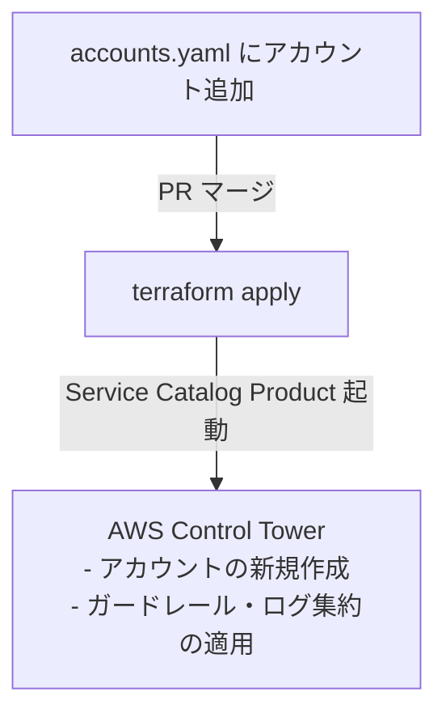

# AWS Landing Zone GitOps アカウント管理 ＆ 運用ランブック

本ドキュメントは、本 Landing Zone 基盤における **`accounts.yaml` を用いた GitOps アカウント管理** の運用ガイド、および新規プロジェクト（EKS等）用のアカウント払い出し後の初期設定手順について解説します。

---

## 1. アカウント払い出し運用ガイド (GitOps / Control Tower 連携)

新しい AWS アカウントの追加は、[accounts.yaml](file:///c:/Git/aws-landing-zone/terraform/accounts.yaml) を用いて GitOps で管理します。



### 1. アカウントの新規追加手順

1. **アカウント定義の追加**:
   - [terraform/accounts.yaml](file:///c:/Git/aws-landing-zone/terraform/accounts.yaml) を開き、新規追加したいアカウントの定義を末尾に追記します。
     ```yaml
     - account_name: "Eks-Workload-Prod"
       account_email: "aws-root+eks-prod@example.com"
       organizational_unit: "Workloads"
     ```
2. **プルリクエストの作成とマージ**:
   - 変更を Git ブランチにコミットして PR を作成します。
   - レビュー承認後、`main` ブランチにマージします。
3. **自動プロビジョニングの開始**:
   - CI/CD パイプラインが `terraform apply` を実行します。
   - `aws_servicecatalog_provisioned_product.control_tower_account["Eks-Workload-Prod"]` リソースが作成され、AWS Control Tower Account Factory にアカウント作成が要求されます。
   - **所要時間**: 約15〜30分。完了すると、ルートメールアドレス宛てに AWS からウェルカムメールが届きます。
4. **事後設定**:
   - 作成された新しいアカウントのアカウント ID (12桁) を取得します。
   - 必要に応じて、`variables.tf` へのアカウント ID 追加、および `IdentityStack` などのアカウント特定ポリシーを適用するために再デプロイを行います。

### 2. アカウント削除（クローズ）手順

> [!WARNING]
> **注意: Terraform の挙動制限**
> `accounts.yaml` からアカウント定義を削除して `terraform apply` を実行すると、Service Catalog 上のプロビジョニング関連付け（Provisioned Product）は登録解除（削除）されますが、**AWS アカウント自体が自動クローズされるわけではありません。**

不要になったアカウントをクローズする際は、以下のハイブリッド手順を実施します：

1. **コードのクリーンアップ**:
   - `accounts.yaml` から対象アカウントの定義を削除し、Git にマージして `terraform apply` を完了させます。
2. **手動によるアカウント閉鎖**:
   - AWS 管理アカウントにログインし、**AWS Organizations コンソール** に移動します。
   - クローズ対象のアカウントを選択し、**「閉じる (Close account)」** をクリックして解約手続きを実行します。

---

## 2. EKS 3層 Web アプリプロジェクト向けのアカウント払い出しと初期設定手順

新たに構築する EKS プロジェクトリポジトリ (`YOUR_ORGANIZATION/aws-eks-three-tier`) のために払い出した 3 つのアカウント (`eks-three-tier-dev`, `eks-three-tier-stg`, `eks-three-tier-prod`) の運用手順です。

### 2-1. アカウントの払い出しと OU 配置
1. [accounts.yaml](file:///c:/Git/aws-landing-zone/terraform/accounts.yaml) に追加した 3 つのアカウント定義をマージして `terraform apply` します。
2. 初期払い出し時における Control Tower の仕様制限およびアカウントファクトリーモジュール（`account_factory/main.tf` 56行目）の実装マッピングにより、各アカウントはまず親の **`Workloads` OU** (`Workloads (ou-workloads-placeholder)`) に配置されます。
3. その後、AWS Control Tower / Organizations コンソール上で、あらかじめ作成された nested OU（Development, Staging, Production）へ対象のアカウントを移動（登録）させてください。

### 2-2. OIDC 連携デプロイロールの適用
1. 各アカウントのプロビジョニング完了後、実際のアカウント ID を `variables.tf` の `accounts` マップに追加して再デプロイします。
2. デプロイにより、3 つのアカウントそれぞれの内部に以下のリソースが自動適用されます：
   - **OIDC アイデンティティプロバイダー** (GitHub Actions との信頼関係用)
   - **`GitHubActionsEKSDeployRole` ロール** (権限: `AdministratorAccess`、セッション有効時間: 2時間)
3. これにより、GitHubリポジトリ `YOUR_ORGANIZATION/aws-eks-three-tier` の Actions ワークフローは、アクセスキーを発行することなく各 AWS 環境へデプロイ可能になります。

### 2-3. IAM Identity Center (SSO) アクセス権限マッピング
Google Workspace と同期された既存の Google グループに対し、以下のアクセス制御が自動で紐付けられます：
- **`aws-dev-group` (開発者グループ)**:
  - `eks-three-tier-dev` ➔ `power_user` (DeveloperPermissionSet に相当する開発者権限)
  - `eks-three-tier-stg` ➔ `read_only` (検証環境に対する参照専用権限)
  - `eks-three-tier-prod` ➔ `read_only` (本番環境に対する平常時参照専用権限 / FISC準拠)
- **`aws-ops-group` (緊急対応/SREグループ)**:
  - `eks-three-tier-prod` ➔ `admin` (BreakGlassPermissionSet に相当する一時特権管理者権限、平常時のグループメンバーは「空」)

### 2-4. ワークロード側リポジトリへのパラメータ連携 (`shared-outputs.md`)
デプロイ完了後、`terraform output` により出力される以下のパラメータを、新規リポジトリ `aws-eks-three-tier` 側の `/docs/governance/shared-outputs.md` 等に書き込みます。

* **EKS 開発環境 (Dev)**:
  - AWS Account ID: `888888888888` (※実値へ置き換え)
  - OIDC Deploy Role ARN: `arn:aws:iam::888888888888:role/GitHubActionsEKSDeployRole`
* **EKS 検証環境 (Stg)**:
  - AWS Account ID: `999999999999`
  - OIDC Deploy Role ARN: `arn:aws:iam::999999999999:role/GitHubActionsEKSDeployRole`
* **EKS 本番環境 (Prod)**:
  - AWS Account ID: `101010101010`
  - OIDC Deploy Role ARN: `arn:aws:iam::101010101010:role/GitHubActionsEKSDeployRole`
