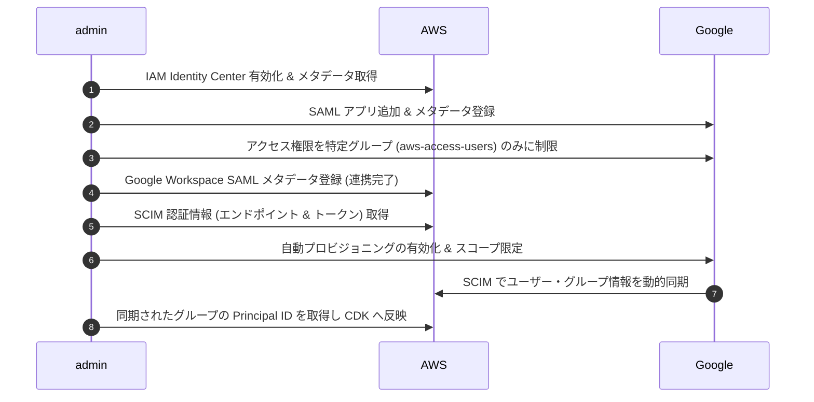

# Google Workspace SAML & SCIM 連携 セットアップ手順書

本ドキュメントは、Google Workspace を IdP (IDプロバイダ) とし、AWS IAM Identity Center との間で SAML 2.0 シングルサインオン (SSO) および SCIM 2.0 自動プロビジョニングを構成するための管理者向け手順書です。

---

## 1. 全体フロー概要



---

## 2. SAML 2.0 連携 (認証) の設定手順

### ステップ 2-1: AWS 側で ID ソース変更の開始
1. AWS 管理アカウントで AWS コンソールにログインし、**AWS IAM Identity Center** に移動します。
2. 左メニューの「設定 (Settings)」を選択し、「ID ソース (Identity source)」タブをクリックします。
3. 「アクション (Actions)」ドロップダウンから「ID ソースの変更 (Change identity source)」を選択します。
4. 「外部 ID プロバイダ (External identity provider)」を選択し、「次へ」をクリックします。
5. 「サービスプロバイダのメタデータ (Service provider metadata)」セクションにある以下の情報を控えます（後ほど Google Workspace 側に入力します）：
   - **AWS SSO ACS URL**
   - **AWS SSO ユーザーポータル URL**
   - **AWS SSO SAML 担当者 ID (Entity ID)**

### ステップ 2-2: Google Workspace で SAML アプリの作成
1. **Google 管理コンソール (Google Admin Console)** (admin.google.com) に特権管理者としてログインします。
2. 左メニューから **「アプリ」 > 「ウェブアプリとモバイルアプリ」** に移動します。
3. **「アプリを追加」 > 「カスタム SAML アプリの追加」** を選択します。
4. アプリの詳細を入力します：
   - **アプリ名**: `AWS IAM Identity Center`
   - **説明**: AWS Landing Zone 用の共通ログインポータル。
   - (任意) ロゴ画像をアップロードします。
5. 「続行」をクリックし、**「Google ID プロバイダの詳細」** 画面で以下のファイルをダウンロードします：
   - **「メタデータをダウンロード」** をクリックし、XML メタデータファイル (`GoogleIDPMetadata.xml`) をローカルに保存します。
6. 「続行」をクリックし、**「サービスプロバイダの詳細」** 画面でステップ 2-1 で控えた情報を入力します：
   - **ACS の URL**: AWS 側から控えた `AWS SSO ACS URL` を入力。
   - **エンティティ ID**: AWS 側から控えた `AWS SSO SAML 担当者 ID (Entity ID)` を入力。
   - **開始 URL**: AWS 側から控えた `AWS SSO ユーザーポータル URL` を入力。
   - **名前 ID の形式**: `EMAIL`
   - **名前 ID**: `Basic Information > Primary email` (ユーザーのプライマリメールアドレス)
7. 「続行」をクリックし、「属性のマッピング」はデフォルトのまま「完了」をクリックします。

### ステップ 2-3: Google 側でのアクセス権限の制限 (全員オフ ＆ 特定グループのみオン)
デフォルトでは作成した SAML アプリはすべてのユーザーに対して「オフ」になっており、AWS ポータルにアクセスできません。特定の Google グループにのみオンに制限します。

1. 追加した「AWS IAM Identity Center」アプリの詳細画面を開きます。
2. **「ユーザーのアクセス権」** セクションをクリックします。
3. **「サービスのステータス」** をデフォルトの **「全員に対してオフ」** に設定されていることを確認します。
4. 画面左側の「グループ」リストから、アクセスを許可する Google グループ (例: `aws-access-users`) を検索し、選択します。
   - *注意: `aws-access-users` グループは事前に Google Workspace 上で作成し、アクセスが必要な開発者を所属させておいてください。*
5. グループに対するサービスのステータスを **「オン」** に変更し、「保存」をクリックします。

### ステップ 2-4: AWS 側での SAML 設定の完了
1. 再び AWS IAM Identity Center の「ID ソースの変更」画面に戻ります。
2. **「ID プロバイダのメタデータ (Identity provider metadata)」** セクションの「IdP SAML メタデータファイル」に、ステップ 2-2 で Google Workspace からダウンロードした XML ファイル (`GoogleIDPMetadata.xml`) をアップロードします。
3. 「次へ」をクリックし、確認画面で `ACCEPT` と入力して「ID ソースを変更」を完了させます。

---

## 3. SCIM 2.0 プロビジョニング (同期) の設定手順

Google Workspace のユーザーとグループ情報を AWS 側へ動的同期し、AWS SSO グループとしてのアクセス権管理を行えるようにします。

### ステップ 3-1: AWS 側で SCIM の有効化
1. AWS IAM Identity Center の「設定 (Settings)」画面に移動します。
2. 「自動プロビジョニング (Automatic provisioning)」セクションで **「有効化 (Enable)」** をクリックします。
3. ポップアップで表示される以下の情報を厳重に管理して控えます（後ほど Google Workspace 側に登録します）：
   - **SCIM エンドポイント (SCIM endpoint)**
   - **アクセスキー (Access token)** (「表示」をクリックしてコピー)

### ステップ 3-2: Google Workspace でのプロビジョニング設定
1. Google 管理コンソールの「ウェブアプリとモバイルアプリ」から、作成した **「AWS IAM Identity Center」** アプリを開きます。
2. **「自動プロビジョニング」** セクションをクリックします。
3. 以下の項目を設定します：
   - **アプリの自動プロビジョニング**: `有効` にチェック。
   - **エンドポイント URL**: AWS から控えた `SCIM エンドポイント` を入力。
   - **アクセス トークン**: AWS から控えた `アクセスキー` を入力。
4. 「接続テスト」を実行し、成功することを確認して「保存」します。

### ステップ 3-3: 同期スコープの絞り込み設定
全ドメインのユーザーを同期するのではなく、SAML アクセス権を与えたグループのメンバーに同期範囲を制限します。

1. 自動プロビジョニングの設定内にある **「同期の範囲 (Scope)」** 設定を開きます。
2. 「特定のグループまたは組織部門のユーザーのみを同期する」を選択します。
3. 検索窓から **`aws-access-users`** グループを選択します。これにより、このグループに含まれるユーザー、およびネストされたグループ情報のみが同期の対象になります。
4. 「保存」をクリックします。
5. プロビジョニングを有効化して初期同期が完了するまで待ちます（通常、数十分〜数時間かかります）。

---

## 4. 同期グループ ID の AWS CDK への反映

SCIM 同期が完了すると、Google Workspace 上のグループが AWS IAM Identity Center の「グループ」画面に作成されます。

1. AWS IAM Identity Center の左メニューから **「グループ (Groups)」** に移動します。
2. 同期された以下のグループを検索し、それぞれの **「グループ ID」** (例: `g-906732a3bf` など) をコピーします：
   - `aws-admins-group`
   - `aws-developers-group`
   - `aws-breakglass-group`
3. 本リポジトリの `config/landing-zone-config.json` を開きます。
4. `sso` ブロックの `groupIds` に、コピーした実際のグループ ID を貼り付けます。
5. `instanceArn` に、AWS SSO 設定画面から取得できる「インスタンス ARN」を正しく設定します。

```json
  "sso": {
    "instanceArn": "arn:aws:sso:::instance/ssoins-実際のインスタンスID",
    "groupIds": {
      "admins": "g-同期されたadminsグループのID",
      "developers": "g-同期されたdevelopersグループのID",
      "breakGlass": "g-同期されたbreakglassグループのID"
    }
  }
```

5. グループ ID 反映後、CDK スタックを再デプロイすることで、同期されたグループへの AWS アカウントごとの権限割り当てが有効化されます。
