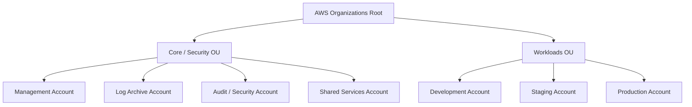

# AWS Organizations 組織単位 (OU) & アカウント設計

AWS Organizations を使用して、セキュリティ、管理、およびワークロードの分離を目的としたマルチアカウント構造を定義します。

## 組織図 (Organization Chart)

## 組織単位 (OU) の定義

### 1. Core OU (Security OU)
インフラ全体の基盤、セキュリティ監視、ログ集約、および共通管理機能を配置する OU です。

- **Management Account (管理アカウント)**:
  - 組織全体のマスターアカウント。請求（Billing）管理、Organizations の管理、IAM Identity Center のマスター、SCP（サービスコントロールポリシー）の定義・適用を行います。
  - セキュリティ保護のため、ワークロードのリソースは配置しません。
- **Log Archive Account (ログアーカイブアカウント)**:
  - 組織内のすべてのアカウントから集約されたログ（CloudTrail, VPC Flow Logs, S3 Access Logs 等）を不変（Immutability）の状態で保存するアカウント。
- **Audit / Security Account (監査アカウント)**:
  - セキュリティ運用と監査用のアカウント。GuardDuty, Security Hub, AWS Config などのサービスを管理し、組織全体のセキュリティアラートを監視・対応します。
- **Shared Services Account (共有サービスアカウント)**:
  - 組織全体で共有するネットワークコンポーネント（Transit Gateway, Route 53 Resolver 等）や共通の CI/CD 実行環境、コンテナレジストリ（ECR）などを配置するアカウント。

### 2. Workloads OU
ビジネスアプリケーションや個別のプロジェクトを実行するための OU です。

- **Development Account (開発環境)**:
  - アプリケーションの開発・プロトタイプ作成・検証用アカウント。開発者が比較的自由な権限（Sandbox または制限付き管理者）を持ちます。
- **Staging Account (検証環境)**:
  - 本番前のステージング・テスト環境用アカウント。本番環境と同等の構成で動作確認やデプロイテストを行います。
- **Production Account (本番環境)**:
  - 本番運用サービスが稼働するアカウント。厳格なセキュリティ制限を課し、人が直接リソースを操作（手動変更）することを原則禁止とし、CI/CD を通じた構成管理を行います。
