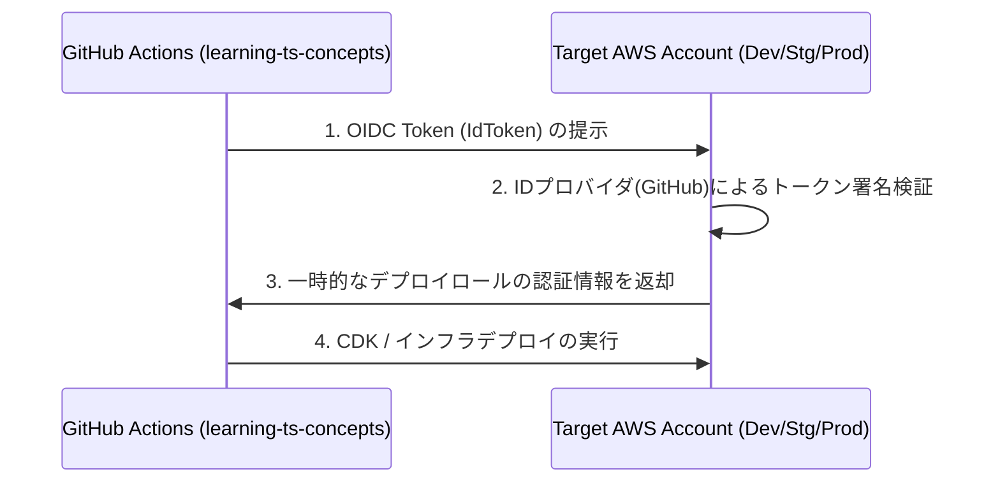

# 共通サービス & CI/CD デプロイ用 IAM ロール（OIDC）設計

個別ワークロードリポジトリである **[learning-ts-concepts](https://github.com/shadow-architect-dev/learning-ts-concepts)** 等の CI/CD パイプラインから、安全に各 AWS アカウント環境（Dev, Stg, Prod）へデプロイを行うための IAM ロール設計です。

## OIDC (OpenID Connect) 連携構成

GitHub Actions に対して永続的な AWS 認証情報（Access Key / Secret Key）を発行せず、短時間のみ有効な一時セッションを取得する OIDC 認証方式を採用します。



## 各環境のアカウントに作成するリソース

### 1. IAM OIDC プロバイダー
- **プロバイダー URL**: `https://token.actions.githubusercontent.com`
- **対象クライアント (Audience)**: `sts.amazonaws.com`

### 2. GitHub Actions 用デプロイメント IAM ロール
- **ロール名**: `GitHubActionsWorkflowDeployRole`
- **信頼ポリシー (Trust Policy)**:
  ```json
  {
    "Version": "2012-10-17",
    "Statement": [
      {
        "Effect": "Allow",
        "Principal": {
          "Federated": "arn:aws:iam::<AccountID>:oidc-provider/token.actions.githubusercontent.com"
        },
        "Action": "sts:AssumeRoleWithWebIdentity",
        "Condition": {
          "StringEquals": {
            "token.actions.githubusercontent.com:aud": "sts.amazonaws.com"
          },
          "StringLike": {
            "token.actions.githubusercontent.com:sub": "repo:shadow-architect-dev/learning-ts-concepts:*"
          }
        }
      }
    ]
  }
  ```
- **許可ポリシー (Permissions)**:
  - CDK デプロイに必要な最小限の権限（CDK Bootstrap の実行ロールを `sts:AssumeRole` する権限）。
  - `arn:aws:iam::aws:policy/AdministratorAccess` (または CDK 実行ロールである `cdk-hnb659fds-deploy-role-*` の引き受け権限)。
